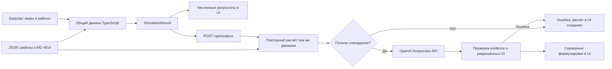
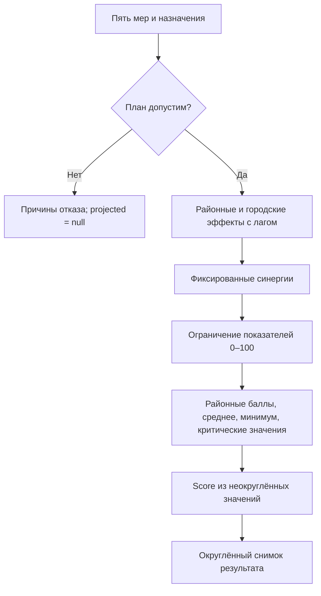

# Аким на 5 часов

Учебный симулятор для городского управленца, аналитика и жюри: выберите пять мероприятий в рамках бюджета **100 условных единиц**, получите воспроизводимый **Astana Quality of Life Score (AQoL)** и AI-объяснение последствий.

**Движок считает, AI объясняет.** Данные синтетические; это не официальная статистика Астаны и не прогноз реальных последствий. AI выбирает акценты из проверенного каталога выводов; свободный текст провайдера не принимается. Точные числа выводятся из расчёта.

[Быстрый старт](#быстрый-старт) · [Установка](#установка-из-чистого-клона) · [Архитектура](#архитектура) · [Проверенные результаты](docs/README_VERIFICATION.md) · [Пример за 95 единиц](#эталонный-сценарий) · [Формула](#как-считается-score) · [Ручная проверка](#как-проверить-приложение-вручную) · [Устранение проблем](#устранение-проблем)

## Что делает пользователь

1. Начинает с одинаковых исходных районов, Score **52,56** и бюджета **100**.
2. Выбирает ровно пять разных мер из каталога M1–M14.
3. Назначает район для районных мер; городские действуют во всех районах.
4. Проверяет стоимость и ограничения плана.
5. Нажимает «Рассчитать сценарий» и сразу получает численный результат.
6. Смотрит показатели до/после, критические значения, вклады мер и синергии.
7. Читает AI-анализ и сохраняет сценарий A, чтобы сравнить его с изменённым B.

## Зачем нужен симулятор

Одинаковая сумма расходов может дать разные результаты в разных районах. План должен учитывать доступность услуг, безопасность, экологию и транспорт, а не только общий балл. Симулятор делает эти компромиссы видимыми: показывает, что изменилось, где сохранились слабые показатели и почему получился именно такой Score.

## Что уже работает

| Область | Реализовано |
|---|---|
| Расчёт | Фиксированный набор данных, стоимость, районный охват, лаги, три синергии, три несовместимости и формула AQoL |
| Поддержка решений | KPI результата, диаграммы AQoL и бюджета, сравнение пяти направлений, районы по приросту, компоненты формулы, вклады и синергии, сравнение A/B |
| AI | Общее объяснение, сильные стороны, риски, компромиссы и рекомендации через OpenAI |
| Надёжность | Проверка решений в движке и API, повторный серверный расчёт, отклонение подменённого результата, отмена устаревшего анализа |
| Работа без AI | Все расчёты и сравнение доступны; вместо объяснения показываются сообщение о недоступности AI и повтор запроса |

Сценарий A хранится **только в памяти страницы**, до перезагрузки. Сброс плана не удаляет сохранённый A: для него есть отдельная кнопка. Авторизации, базы данных и сохранения сценариев между сессиями нет.

## Архитектура



Next.js обслуживает страницу и серверный маршрут. Браузер рассчитывает результат локально; сервер проверяет его перед обращением к провайдеру. Нет фонового агента, самостоятельно принимающего городские решения.

## Граница между расчётом и AI

| Детерминированный код | AI-интерпретация |
|---|---|
| Валидность плана, расход и остаток | Сильные стороны и риски |
| Эффекты с лагом, районный охват, синергии | Объяснение компромиссов и последствий |
| Районные показатели, штраф, Score и прирост | Рекомендации пересмотреть меры или пересчитать альтернативу |

**AI не рассчитывает и не перезаписывает официальный Score приложения.** Его ответ хранится отдельно от `SimulationResult`.

**AI возвращает только идентификаторы разрешённых выводов**, а не прозу. Сервер строит каталог по каноническому результату: улучшившиеся и неизменившиеся направления, слабые показатели, лаги и допустимые замены. OpenAI выбирает акценты и порядок. Сервер проверяет ID, их типы, уникальность, дополнительные поля и evidence, затем подставляет собственные формулировки. Любой неизвестный ID или свободный текст отклоняется целиком. Рекомендации описывают замену внутри полного плана, уже проверенного движком; они не обещают оптимальность или лучший Score.

## Данные модели

Источник работающего приложения — [data/city-demo.json](data/city-demo.json); описание задания — [docs/OFFICIAL_CASE.md](docs/OFFICIAL_CASE.md). «Официальный» здесь означает набор из кейса HackAlem, а не городскую статистику.

| Район | ID | Доля населения модели |
|---|---|---:|
| Есиль | `esil` | 27% |
| Алматы | `almaty` | 24% |
| Сарыарка | `saryarka` | 20% |
| Байконур | `baikonur` | 13% |
| Нура | `nura` | 16% |

Поле `population` содержит **долю**, а не число жителей; сумма долей равна единице. Каждый показатель нормирован к **0–100**, выше — лучше.

| ID | Показатель | Вес в районном балле |
|---|---|---:|
| T1 | Разгрузка дорог | 0,10 |
| T2 | Общественный транспорт | 0,10 |
| E1 | Озеленение | 0,09 |
| E2 | Качество воздуха | 0,11 |
| S1 | Школы и детсады | 0,11 |
| S2 | Первичная медицина | 0,11 |
| B1 | Безопасность улиц | 0,09 |
| B2 | Безопасность движения | 0,09 |
| C1 | Надёжность ЖКХ | 0,10 |
| C2 | Обращения жителей | 0,10 |

В каталоге **14 мер M1–M14**. Каждая содержит направление, название, стоимость, `scope`, лаг в кварталах и полные эффекты по показателям — до масштабирования лагом. `district` требует один выбранный район; `city` применяется ко всем пяти. Цены — условные единицы, не тенге. Полный каталог с ценами и знаками эффектов находится в [тексте кейса](docs/OFFICIAL_CASE.md#2-каталог).

## Правила решений

- Бюджет — **100**, расход не выше бюджета; неиспользованный остаток не даёт бонуса.
- Ровно **5 разных мер**, повтор одной меры даже в другом районе запрещён.
- Не больше **2 мер одного направления**. По одной в каждой сфере не требуется: допустимы планы, охватывающие минимум три направления.
- Районная мера требует существующий район; для городской район **не передаётся**.
- **M1 и M3** несовместимы независимо от районов.
- **M4 и M7**, а также **M5 и M13** несовместимы, если назначены в один район.
- Невалидный план получает причины отказа, `projected: null` и `delta: null`; исходное состояние остаётся доступно.
- Порядок добавления мер не меняет результат: движок канонически сортирует решения.

При составлении плана UI допускает неполный набор, но окончательный расчёт и API требуют все пять решений. Доступность кнопок проверяется теми же правилами движка.

## Как считается Score

Горизонт **H = 8 кварталов**. Для каждой выбранной меры:

```text
Реализованный эффект = полный эффект × (8 − лаг) / 8
Итоговый показатель = clip(исходный + сумма эффектов + синергии, 0, 100)

D_d    = сумма(вес показателя × итоговый показатель) в районе d
D_avg  = сумма(доля населения района × D_d)
N_crit = число пар «район × показатель» со значением строго ниже 40

Score = 0,7 × D_avg + 0,3 × min(D_d) − N_crit
```

Среднее отражает общий результат, а вклад худшего района не позволяет скрыть его низкие показатели за благополучными районами. За каждое критическое значение вычитается один балл; значение **ровно 40 не штрафуется**. Веса десяти показателей в таблице выше дают сумму 1.

| Сочетание мер | Фиксированный бонус | Где применяется |
|---|---|---|
| M1 + M2 | T1 +2 | Район M1 |
| M10 + M12 | B1 +2 | Район M10 |
| M5 + M6 | E2 +2 | Район M5 |

Бонусы не масштабируются лагом и применяются по одному разу. Ограничение 0–100 выполняется после суммирования всех вкладов.



Движок использует неокруглённые значения для формулы, затем возвращает агрегаты снимка с округлением до двух знаков. Прирост считается из сырых Score и округляется отдельно: для примера ниже **56,54 − 52,56 = 3,98**, но корректный возвращаемый прирост — **3,99**. Средние пяти направлений — вспомогательные показатели, не замена этой формулы.

## Эталонный сценарий

Выберите вкладку направления, район, затем «Добавить в план» для каждой строки:

| Мера | Вкладка | Назначение | Стоимость |
|---|---|---|---:|
| M7 — Школа + детсад | Социальная инфраструктура | Нура | 24 |
| M8 — Центр семейного здоровья / поликлиника | Социальная инфраструктура | Нура | 20 |
| M10 — Освещение и камеры | Безопасность | Нура | 12 |
| M12 — Единая цифровая платформа обращений | Городские сервисы | Весь город, район не выбирать | 14 |
| M5 — Перевод частного сектора на чистое топливо | Экология и озеленение | Сарыарка | 25 |

После «Рассчитать сценарий»:

| Проверка | Ожидаемое значение |
|---|---:|
| Расход / остаток | **95 / 5** |
| Исходный / итоговый Score | **52,56 → 56,54** |
| Прирост | **+3,99** |
| Критические показатели | **2 → 0** |
| S2 Нуры | **35 → 43,75** |
| Синергия | **M10 + M12**, B1 +2 в Нуре |

Неокруглённые значения формулы: база **52,55768**, результат **56,54307**. Они объясняют округление, но не являются значениями поля `overall`, которое возвращается с двумя знаками.

## Технологии

| Слой | Технология из lockfile | Назначение |
|---|---|---|
| Framework | Next.js 16.3.6, App Router | Страница и серверный API |
| Интерфейс | React 19.3.0, Tailwind CSS 4.3.3, Lucide | Формы, таблицы, стили, значки |
| Модель и валидация | TypeScript 5.9.3, собственные функции | Расчёт и проверка входов |
| AI | OpenAI Responses API через серверный `fetch` | Структурированное объяснение |
| Тесты | Vitest 5.0.1 | Модель, диагностика, API и ошибки |
| Данные | Локальный JSON | Фиксированный набор без БД |

## Структура репозитория

```text
.
├── src/
│   ├── app/                   # UI и POST /api/analyze
│   ├── components/            # Панель ScenarioReview, модель отображения и тесты
│   ├── types/city.ts          # Контракты, метрики, веса
│   └── lib/
│       ├── data/              # Загрузка и проверка набора
│       ├── simulation/        # Правила, эффекты, Score
│       ├── ai/                # Провайдер, схема, ошибки
│       ├── diagnostics/       # Дополнительные расчёты; пока без UI
│       └── opportunity-cost/  # Поиск альтернатив движком; пока без UI
├── data/                      # Активный набор и описание происхождения
├── docs/                      # Кейс, контракты, демо и проверки
├── public/                    # SVG-фон интерфейса
├── .env.example
├── package.json
└── package-lock.json
```

Основной интерфейс находится в `src/app/page.tsx`. `data/budget-breakdowns.json` — неиспользуемый архив прежнего прототипа; активный загрузчик его не импортирует. Разбивка закупок для M1–M14 в приложении не придумана.

## Требования

- Соединение с реестром npm для установки зависимостей.
- Git и доступ к репозиторию на GitHub; для закрытого репозитория нужна авторизация.
- **Node.js 24.x** — проверено на **24.12.0**, npm **11.6.2**. Для полного набора инструментов допустимы диапазоны Node `^22.12.0 || ^24.0.0 || >=26.0.0`, указанные установленным Vitest; не ориентируйтесь только на минимум Next.js.
- Для AI: серверный ключ OpenAI, доступ к выбранной модели и соединение с API. Для расчётов, сравнения и тестов ключ не нужен.

## Установка из чистого клона

```sh
git clone https://github.com/BAITC-Hacks/hack-aac97b57-qarapaiym.git
cd hack-aac97b57-qarapaiym
npm ci
```

Используйте `npm ci`, чтобы установить версии из lockfile. Не запускайте установку поверх работающего dev/production-процесса этого же каталога.

## Настройка окружения

В новом клоне создайте локальный файл настроек:

**Bash / macOS / Linux:**

```sh
cp .env.example .env.local
```

**Windows PowerShell:**

```powershell
Copy-Item .env.example .env.local
```

Если файл уже существует, отредактируйте его вместо перезаписи. Для запуска с AI заполните:

```dotenv
OPENAI_API_KEY=your_key_here
OPENAI_MODEL=gpt-5.6-luna
```

| Переменная | Поведение |
|---|---|
| `OPENAI_API_KEY` | Серверный ключ. Оставьте пустым для проверки приложения без AI |
| `OPENAI_MODEL` | Имя модели; текущее значение по умолчанию в коде — `gpt-5.6-luna` |

Доступность указанной модели зависит от аккаунта провайдера. Используйте доступную вам модель, совместимую со структурированным форматом текущего Responses-запроса; не считайте значение в примере гарантией доступа. Перезапустите сервер после изменения окружения. Без ключа Score появляется, а блок AI сообщает об отсутствии настройки и предлагает повторить запрос.

## Запуск

| Режим | Команда | Примечание |
|---|---|---|
| Разработка | `npm run dev` | Откройте http://localhost:3000 |
| Сборка | `npm run build` | Стандартная production-сборка Next.js; проверена |
| Production | `npm start` | Выполняйте после сборки; порт по умолчанию 3000 |

Остановите сервер сочетанием Ctrl+C. Если порт занят, используйте `npm run dev -- --port 3010` или `npm start -- --port 3010` и откройте соответствующий адрес. Не запускайте dev и сборку одновременно в одном каталоге.

## Автоматические проверки

```sh
npm test
npm run typecheck
npm run build
```

| Команда | Что проверяет |
|---|---|
| `npm test` | 53 теста текущей версии: модель, цели/правила, синергии, ошибки, диагностика/альтернативы, серверная проверка и ответы AI с подставным провайдером |
| `npm run typecheck` | Генерация типов маршрутов Next.js и TypeScript без сборки JS |
| `npm run build` | Компиляция, TypeScript и production-страницы/маршрут |

AI-тесты не отправляют платные запросы. Они проверяют отказ для ложной прозы даже с верным evidence; отдельные тесты страницы проверяют запоздалые ответы после смены/сброса плана. Итоговая проверка: [FINAL_SUBMISSION_VERIFICATION.md](FINAL_SUBMISSION_VERIFICATION.md). Предыдущая проверка README сохранена как история: [docs/README_VERIFICATION.md](docs/README_VERIFICATION.md).

## Как проверить приложение вручную

1. Запустите сервер. Убедитесь: бюджет **100**, исходный Score **52,56**, план **0/5**.
2. Соберите [эталонный сценарий](#эталонный-сценарий), нажмите расчёт. Проверьте **95 / 5**, **56,54**, **+3,99**, критические **2 → 0**.
3. В панели результата раскройте «Все показатели районов» и просмотрите «За счёт чего меняется результат». Проверьте S2 Нуры **43,75** и бонус M10+M12.
4. Нажмите «Сохранить как сценарий A». В плане поменяйте район **M7 на Есиль**. Старое объяснение и результат должны исчезнуть. Пересчитайте: **55,30**, расход по-прежнему **95**; появится сравнение A/B.
5. Сбросьте план. Для точного бюджета добавьте **M1 Нура, M2 город, M4 Сарыарка, M5 Сарыарка, M8 Нура**: расход **100**, остаток **0**, Score **55,34**.
6. Сбросьте план. Попробуйте **M1 Нура, M2 город, M5 Сарыарка, M6 город, M14 город**: стоимость набора **101**. Последнее добавление блокируется по бюджету; полного рассчитанного сценария быть не должно.
7. Проверьте «Сбросить решения»: **0/5**, бюджет **100**. Кнопка «Вернуть решения» позволяет отменить сброс; сохранённый A удаляется отдельно или перезагрузкой.
8. При настроенном ключе дождитесь AI-объяснения после расчёта. При пустом ключе убедитесь, что вместо него показана ошибка, а Score и районные таблицы остаются. Для такой проверки очистите ключ **в своей локальной копии** и перезапустите сервер.

## API и путь AI-запроса

`POST /api/analyze` принимает **полный `SimulationResult`**, а не только список мер. Получайте его через общий движок:

```ts
import { cityDataset } from '@/lib/data';
import { simulateScenario } from '@/lib/simulation';

const result = simulateScenario(cityDataset, [
  { initiativeId: 'M7', districtId: 'nura' },
  { initiativeId: 'M8', districtId: 'nura' },
  { initiativeId: 'M10', districtId: 'nura' },
  { initiativeId: 'M12' },
  { initiativeId: 'M5', districtId: 'saryarka' },
]);
// В браузере: POST JSON.stringify(result) на /api/analyze.
```

Это пример импорта **внутри проекта**, не команда для запуска в терминале.

```text
SimulationResult → сервер повторяет расчёт по selection
→ полное сравнение с каноническим результатом
→ запрос OpenAI с фактами, вкладами, синергиями и каталогом
→ проверка ID/evidence → серверные тексты summary, strengths, risks, tradeoffs, recommendations
```

Успех: HTTP 200, пять полей анализа. `recommendations` содержит `title`, `rationale`, `category`. Provider возвращает ID; сервер отображает их в проверенные тексты. Внутренний provider-evidence удаляется перед ответом UI. Ключ в ответ не включается.

Маршрут использует `Cache-Control: no-store`, ограничение входа **50 000 байт**, ответа провайдера **100 000 байт**, тайм-аут провайдера **60 секунд** и `store: false` в запросе. Последнее не является обещанием отсутствия всех логов у провайдера.

## Ошибки и поведение интерфейса

| Ситуация | Что происходит |
|---|---|
| Неполный план, повтор, несовместимость, неверный район | Движок возвращает причины; UI блокирует недопустимое добавление или расчёт |
| Перерасход | Добавление блокируется; поданный напрямую невалидный результат API отклоняет до AI |
| Некорректный JSON, слишком большой или подменённый результат | HTTP 400; новый AI-анализ не запускается |
| Нет ключа / ключ отклонён | HTTP 503; численный результат сохранён, есть повтор объяснения |
| Ошибка сервиса / некорректный AI-ответ | HTTP 502; расчёт не пропадает |
| Тайм-аут провайдера | HTTP 504; можно повторить объяснение |
| Изменение плана во время запроса | Старый запрос отменяется; проверка поколения запроса не даёт ему заменить новый анализ |

Приложение не подставляет выдуманный AI-ответ при отказе провайдера.

## Воспроизводимость

Набор данных хранится в Git, зависимости фиксируются lockfile, расчёт не использует случайность и выполняется одинаковым движком в браузере и на сервере. Меры сортируются перед применением эффектов. При одинаковых данных и решениях численный результат одинаков; AI-текст может различаться.

Зафиксируйте версию командой `git rev-parse HEAD` перед демонстрацией. Старые записи в [docs/VERIFICATION.md](docs/VERIFICATION.md) — исторические проверки, а не автоматическая гарантия текущего состояния. Свежая проверка этой инструкции приведена отдельно в [README_VERIFICATION](docs/README_VERIFICATION.md).

## Происхождение данных

Районы, доли населения, показатели, цены и эффекты — **синтетический образовательный набор из предоставленного кейса**. Это не фактические закупочные цены, демографическая статистика или оценка реальной эффективности городских программ. Не применяйте полученный Score как прогноз или обоснование реального финансирования.

## Ключи и безопасность

`OPENAI_API_KEY` читается только серверным модулем; не добавляйте префикс `NEXT_PUBLIC_`. `.env.local` исключён из Git, отслеживаемый `.env.example` содержит пустой ключ. Не размещайте ключи в README, клиентском коде или снимках экрана.

В проверенном текущем дереве не обнаружены реальные ключи по проверенным шаблонам; это не аудит всей истории Git. Маршрут не имеет пользовательской авторизации и ограничения частоты запросов. Перед публичным размещением платного API нужны отдельные меры защиты и контроля расходов.

## Известные ограничения

- AI ограничен выбором и порядком проверенных выводов. Свободного диалога и произвольной генерации пояснений нет; качество расстановки приоритетов остаётся задачей AI.
- Горизонт фиксирован: модель не строит поквартальную траекторию и не моделирует неопределённость, инфляцию или последующие эксплуатационные затраты.
- Сравнение A/B локально для страницы; нет сравнения команд, совместной работы или постоянного хранения.
- Поиск альтернатив используется сервером для проверенных рекомендаций. Детальная диагностика расходов остаётся библиотечным модулем; стейкхолдер-анализ отсутствует.
- Разные планы могут иметь одинаковый агрегированный Score при разных районных эффектах.

## Возможное развитие

Не реализовано в текущем интерфейсе:

1. Более широкий каталог проверяемых качественных выводов.
2. Интерактивное применение альтернатив и детализация расходов.
3. Анализ чувствительности и неопределённости эффектов.
4. Постоянное сохранение и совместное сравнение сценариев.

## Контекст HackAlem

Проект решает кейс **«Аким на 5 часов»**: показать, как пять решений при едином бюджете меняют условный город, и объяснить компромиссы. [Критерии приёмки](ACCEPTANCE_TESTS.md), [полный кейс](docs/OFFICIAL_CASE.md), [короткий сценарий выступления](docs/JUDGE_DEMO_RU.md).

## Устранение проблем

| Проблема | Вероятная причина | Что сделать |
|---|---|---|
| `git clone` возвращает 404 / access denied | Нет доступа к репозиторию | Авторизуйтесь в GitHub и проверьте доступ; не меняйте URL на выдуманный |
| `npm ci`: Windows `EPERM` на `.node` | Запущенный процесс держит native-библиотеку | Остановите сервер именно этого каталога и повторите; для проверки используйте новый клон |
| Ошибка версии Node | Среда не соответствует требованиям инструментов | Проверьте `node --version`, используйте Node 24.x, затем `npm ci` |
| Порт 3000 занят | Уже работает другой сервер | Запустите с `-- --port 3010` и откройте порт 3010 |
| `npm start` не находит production build | Сборка не выполнена | Сначала `npm run build`, затем `npm start` |
| AI не настроен или ключ отклонён | Пустой/неподходящий ключ, старое окружение процесса | Проверьте `.env.local`, права аккаунта/модели и перезапустите сервер |
| AI недоступен или отвечает с тайм-аутом | Сеть, лимиты или отказ провайдера | Проверьте доступ к API; повторите объяснение. Score пересчитывать не нужно |
| Нельзя добавить меру | Район не выбран, бюджет, повтор, максимум мер или конфликт | Прочитайте причину у карточки; исправьте план, не обходите валидатор |
| AI возвращает неизвестный вывод или произвольный текст | Ответ не соответствует разрешённому каталогу | Ответ скрывается; повторите разбор, расчёт остаётся доступен |

## FAQ

**AI рассчитывает Score?** Нет. Общий движок TypeScript рассчитывает Score; AI выбирает проверенные выводы по готовому результату и не может менять числа или добавлять свою прозу.

**Можно работать без AI API?** Да: выбор, расчёт, районные таблицы и сравнение A/B работают без ключа. Объяснение будет недоступно.

**Это реальные данные Астаны?** Нет. Это синтетический набор кейса с названиями районов Астаны.

**Почему при похожих бюджетах получаются разные Score?** Меры имеют разные эффекты, лаги и охват; назначения меняют худший район и число критических показателей. Сам расход в формулу Score не входит.

**Почему учитывается самый слабый район?** Так задан критерий кейса: он получает отдельный вес 30%, чтобы городской средний балл не скрывал низкий районный результат.

**Почему именно пять решений?** Это правило сценария HackAlem; внутри этих пяти можно выбрать до двух мер одного направления.

## Быстрый старт

В новом каталоге, Bash:

```sh
git clone https://github.com/BAITC-Hacks/hack-aac97b57-qarapaiym.git
cd hack-aac97b57-qarapaiym
npm ci
cp .env.example .env.local
npm run dev
```

В PowerShell замените `cp` на `Copy-Item`. Для AI заполните ключ в `.env.local` до запуска; пустой ключ подходит для проверки расчётов.

Откройте **http://localhost:3000** и соберите [эталонный сценарий за 95 единиц](#эталонный-сценарий).
